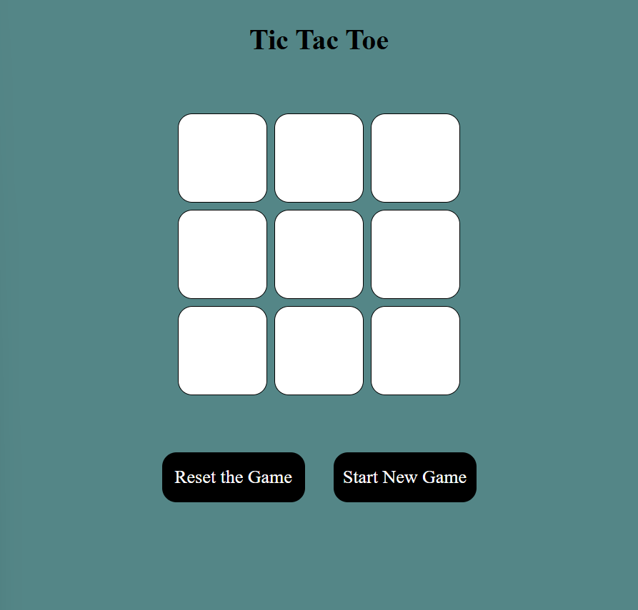

# Tic-Tac-Toe

This is a simple web-based Tic Tac Toe game built using HTML, CSS, and JavaScript. The game allows two players to take turns marking X and O on a 3x3 grid. The first player to get three marks in a row (vertically, horizontally, or diagonally) wins. If all boxes are filled without a winner, the game ends in a draw.

# Features

-Interactive 3x3 game grid 
-Two-player functionality (X and O) 
-Win detection for all possible patterns 
-Game draw detection 
-Reset and New Game buttons to restart the game 

# Technologies Used

-HTML: Structure of the game 
-CSS: Styling for a visually appealing layout 
-JavaScript: Game logic and interactivity 

# Game Logic Overview

-Players take turns clicking the grid boxes. 
-The game checks for a win after each move by comparing the current state with predefined winning patterns. 
-If all 9 boxes are filled without a winner, the game announces a draw. 
-Use the Reset button to restart the game. 
-Use the Start New Game button to refresh the page and begin a new round. 

# Live Demo & Screen Shots

Live Demo :

https://akankshap-tic-tac-toe.netlify.app
 
Screen Shots :

